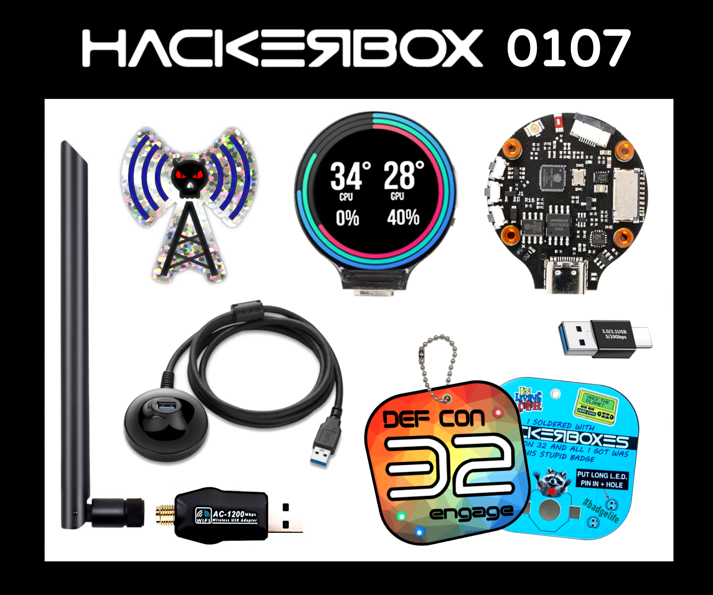
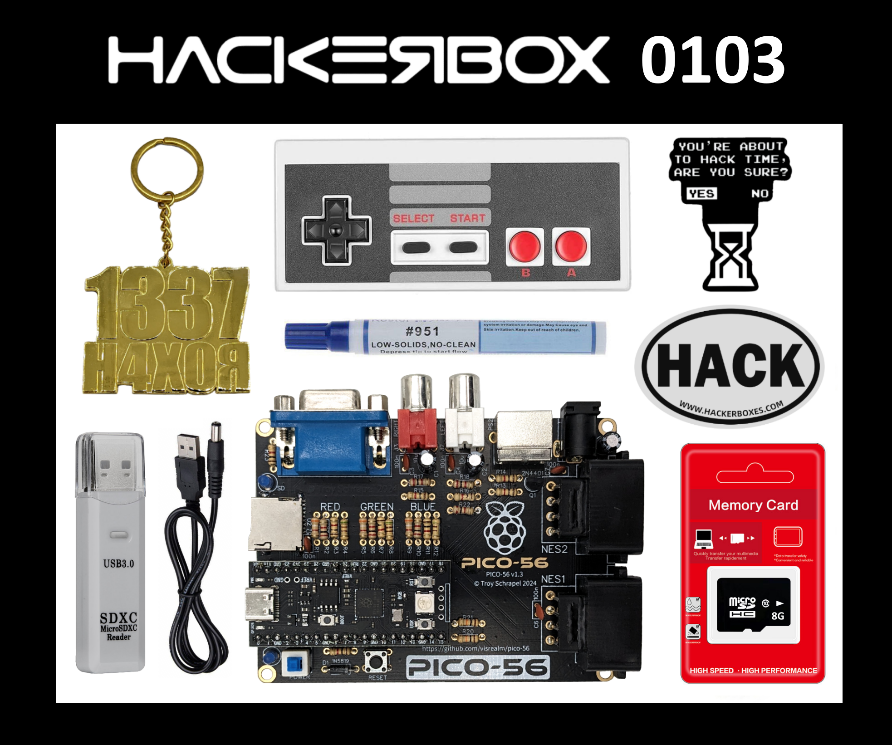
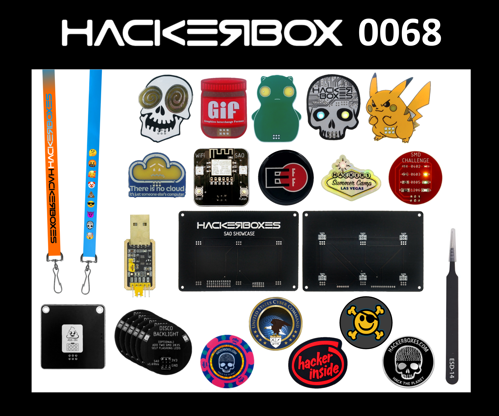
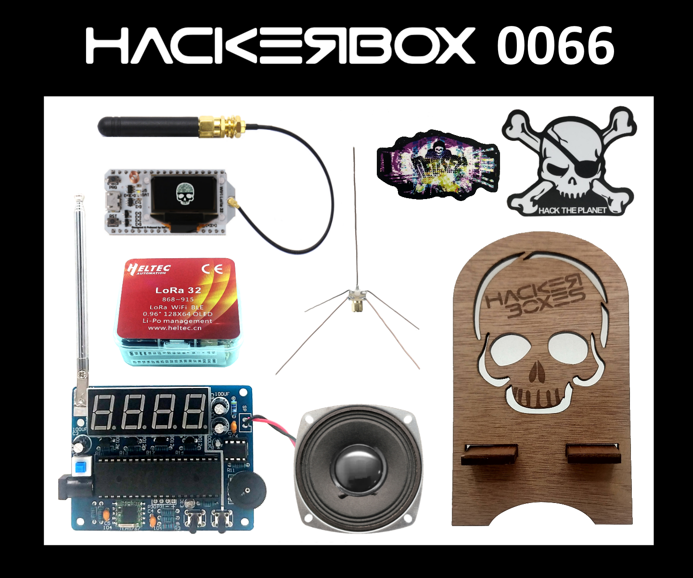
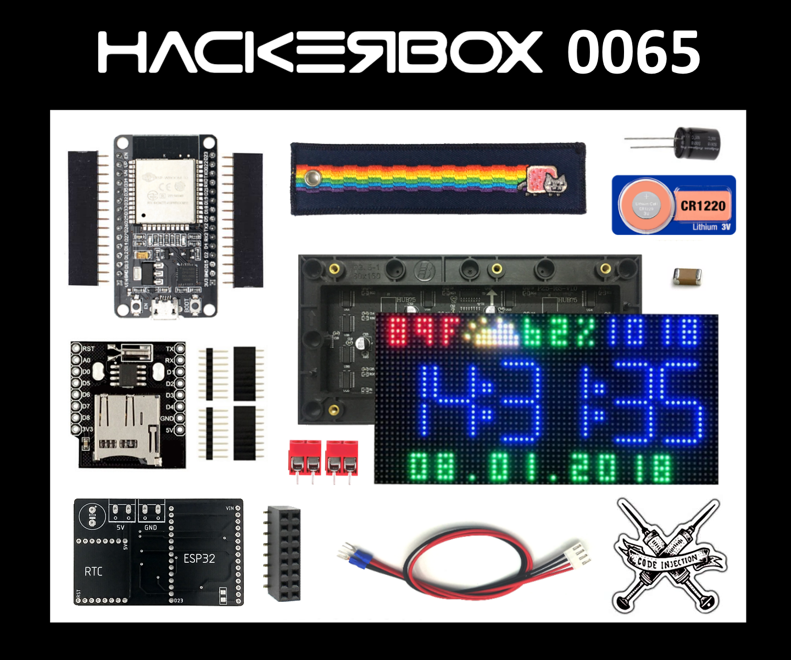
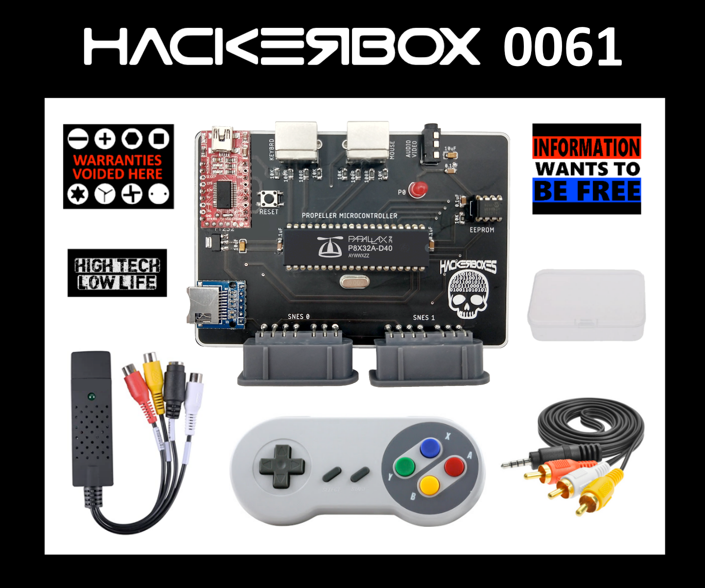
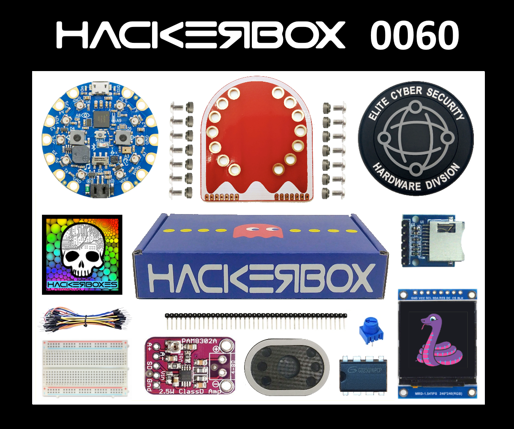
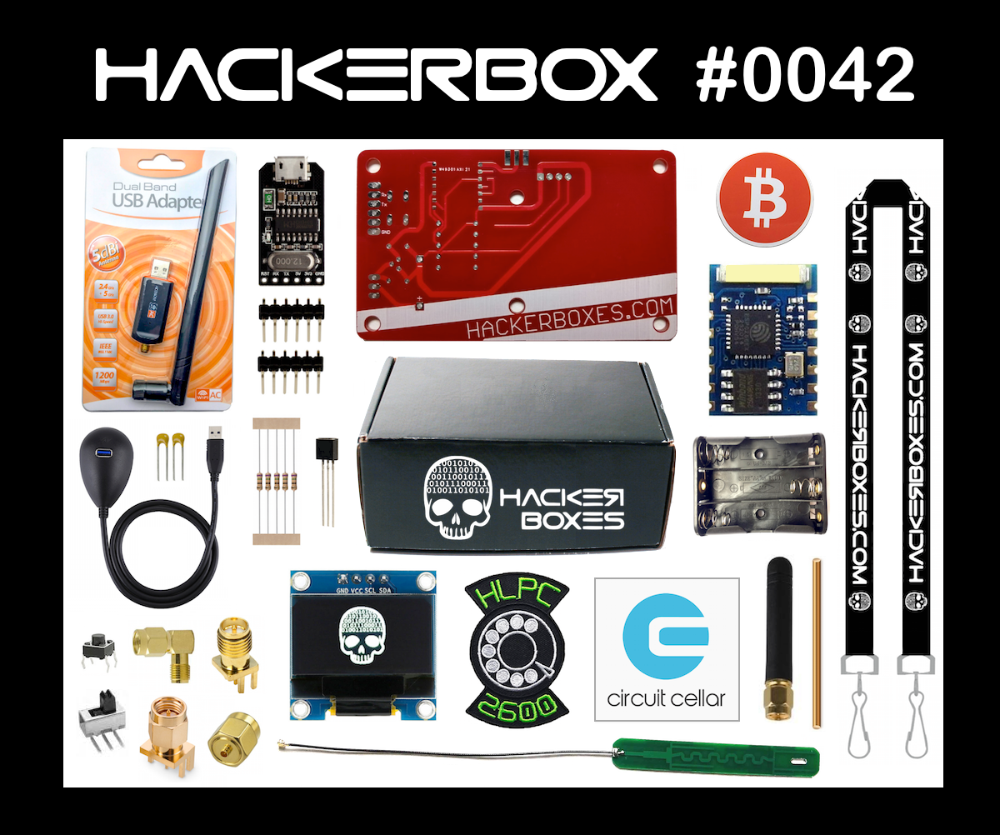

# hackerbox-boms
List of contents contained in each HackerBox

Refer to [hb-boms.json](hb-boms.json) for a json version of the list

## HackerBox BOMs

| name | picture | contents |
| ------ | --------- | ---------- |
| [hackerbox-0117-rfid-lab](https://hackerboxes.com/collections/past-hackerboxes/products/hackerbox-0117-rfid-lab) |  | <ul><li>HackerBox 0117 Collectable Reference Card</li><li>7941W Dual Frequency RFID Module</li><li>TFT Color 170x320 Display Module</li><li>Five 1 MegaOhm SMD1206 Resistors</li><li>Nylon Standoff Hardware</li><li>Two S50 1K 13.56MHz RFID Cards</li><li>Circular Adhesive NFC Tag</li><li>Dog Tag Necklace Chain</li><li>Official <a href="https://www.instructables.com/HackerBox-0117-RFID-Lab/">Online Guide</a> for HackerBox 0117</li></ul> |
| [hackerbox-0116-risc-is-good](https://hackerboxes.com/collections/past-hackerboxes/products/hackerbox-0116-risc-is-good) |  | <ul><li>HackerBox 0116 Collectable Reference Card</li><li>CH32V003 RISC-V Mini Game Console</li><li>Three SOP-8 CH32V003J4M6 RISC-V Microcontrollers</li><li>Black 170 Point Solderless Breadboard</li><li>10KOhm Potentiometer</li><li>Nexus-1 BitHead S.A.O.</li><li>Spacewalker S.A.O.</li><li>RISC is GOOD Metallic Glitter Sticker</li><li>Official <a href="https://www.instructables.com/HackerBox-0116-RISC-Is-Good/">Online Guide</a> for HackerBox 0116</li><li><a href="https://hackaday.io/project/191400-ch32v003-risc-v-mini-game-console">CH32V003 RISC-V Mini Game Console</a></li></ul> |
| [hackerbox-0115-wispier](https://hackerboxes.com/collections/past-hackerboxes/products/hackerbox-0115-wispier) |  | <ul><li>HackerBox 0115 Collectable Reference Card</li><li>Two ESP32-WROOM-32U Modules with IPEX RF Ports</li><li>Four Cell 18650 Lithium Battery Power Shield</li><li>Serial USB CP2102 Module with Female-Female Jumper Wires</li><li>OLED Module with 128×32 Pixels and I2C Interface</li><li>Three Dual-Band <meta charset="utf-8"> Omnidirectional SMA-Male Antennas</li><li>Micro SMD Pushbutton Switches</li><li>Two pin Female Power Header Socket</li><li>4.7K Axial Through Hole Resistor</li><li>Official <a href="https://www.instructables.com/HackerBox-0115-Wispier/">Online Guide</a> for HackerBox 0115</li></ul> |
| [hackerbox-0114-wopr](https://hackerboxes.com/collections/past-hackerboxes/products/hackerbox-0114-wopr) |  | <ul><li>HackerBox 0114 Collectable Reference Card</li><li>ESP32-C3 Supermini Development Board</li><li>WOPR Control Interface PCB</li><li>USB-C to USB-A Cable</li><li>W.O.P.R. Sticker</li></ul> |
| [hackerbox-0113-hardcore](https://hackerboxes.com/collections/past-hackerboxes/products/hackerbox-0113-hardcore) |  | <ul><li>HackerBox 0113 Collectable Reference Card</li><li>Acrylic Enclosure for Calculator Kit</li><li>STC8G1K08A-Based Spiral LED Kit</li><li>Additional STC8G1K08A DIP-8 MCU (blank)</li><li>STC51 Programming Target Kit</li><li>Ex<meta charset="utf-8">clusive Reverse Engineer Iron-On Patch</li><li>Official <a href="https://www.instructables.com/HackerBox-0113-Hardcore/">Online Guide</a> for HackerBox 0113</li></ul> |
| [hackerbox-0112-gamelife](https://hackerboxes.com/collections/past-hackerboxes/products/hackerbox-0112-gamelife) |  | <ul><li>HackerBox 0112 Collectable Reference Card</li><li>Adafruit CharliePlex LED Matrix Bonnet</li><li>PicoNES pHAT PCB</li><li>Female 2x20 Raspberry Pi Header</li><li>NES Game Controller</li><li>HDMI to MiniHDMI Cable</li><li>Two 1.8K SMD-1206 Resistors</li><li>Randomly selected from our math &amp; science collection</li><li>Official <a href="https://www.instructables.com/HackerBox-0112-Gamelife/">Online Guide</a> for HackerBox 0112</li></ul> |
| [hackerbox-0111-relay](https://hackerboxes.com/collections/past-hackerboxes/products/hackerbox-0111-relay) |  | <ul><li>HackerBox 0111 Collectable Reference Card</li><li>Exclusive LoRa C3 OLED PCB</li><li>Ra-01SH LoRa Module</li><li>915MHz Antenna</li><li>Exclusive LoRa I/O PCB</li><li>Ra-01SH LoRa Module</li><li>915MHz Antenna</li><li>Two 8-Pin Terminal Blocks</li><li>Sixteen Element RGB LED Ring</li><li>Exclusive Triple Sticker Sheet</li><li>Official <a href="https://www.instructables.com/HackerBox-0111-Relay/">Online Guide</a> for HackerBox 0111</li></ul> |
| [hackerbox-0110-synth](https://hackerboxes.com/collections/past-hackerboxes/products/hackerbox-0110-synth) |  | <ul><li>HackerBox 0110 Collectable Reference Card</li><li>Exclusive RP-Synthy PCB</li><li>Round 240x240 Color Display Module</li><li>Two EC11 Rotary Encoders with Aluminum Knobs</li><li>Exclusive Full-Color RP-Touchy PCB</li><li>Twenty-Six 1 MegaOhm SMD1206 Resistors</li><li>Hemispherical Self-Adhesive Rubber Bumpers</li><li>Exclusive HACK THE PLANET Luggage Tag</li><li>Official <a href="https://www.instructables.com/HackerBox-0110-Synth/">Online Guide</a> for HackerBox 0110</li></ul> |
| [hackerbox-0109-bluetooth](https://hackerboxes.com/collections/past-hackerboxes/products/hackerbox-0109-bluetooth) |  | <ul><li>HackerBox 0109 Collectable Reference Card</li><li>Exclusive Burning Chrome PCB</li><li>PCM5102A I2S Digital Audio Module</li><li>Eight Pixel RGB LED Module</li><li>USB Bluetooth 5.3 Adapter</li><li>USB Keyboard and Mouse to BLE Adapter</li><li>Official <a href="https://www.instructables.com/HackerBox-0109-Bluetooth/">Online Guide</a> for HackerBox 0109</li></ul> |
| [hackerbox-0108-newstalgia](https://hackerboxes.com/collections/past-hackerboxes/products/hackerbox-0108-newstalgia) |  | <ul><li>HackerBox 0108 Collectable Reference Card</li><li>4-Port USB HUB Module</li><li>Blue Aluminum USB-C OTG Cable</li><li>Two Hacker Stickers</li><li>Official <a href="https://www.instructables.com/HackerBox-0108-Newstalgia/" rel="noopener" target="_blank">Online Guide</a> for HackerBox 0108</li></ul> |
| [hackerbox-0107-dock](https://hackerboxes.com/collections/past-hackerboxes/products/hackerbox-0107-dock) |  | <ul><li>HackerBox 0107 Collectable Reference Card</li><li>RTL8812BU Dual Band USB Wi-Fi Module</li><li>Exclusive HackerBox DEF CON 32 Mini Badge Kit</li><li>USB-A Male to USB-C Male Adapter</li><li>Official <a href="https://www.instructables.com/HackerBox-0107-Dock/">Online Guide</a> for HackerBox 0107</li></ul> |
| [hackerbox-0106-epoch](https://hackerboxes.com/collections/past-hackerboxes/products/hackerbox-0106-epoch) |  | <ul><li>HackerBox 0106 Collectable Reference Card</li><li>Multifunction Expansion Shield</li><li>CR2032 Coin Cell</li><li>Heat Shrink Tubing 2mm x 40mm</li><li>Folding 7-in-1 Locksport Tool</li><li>USB-C to USB-A Adapter</li><li>Official <a rel="noopener" href="https://www.instructables.com/HackerBox-0106-Epoch/" data-mce-href="https://www.instructables.com/HackerBox-0106-Epoch/" target="_blank">Online Guide</a> for HackerBox 0106</li></ul> |
| [hackerbox-0105-rf-boy](https://hackerboxes.com/collections/past-hackerboxes/products/hackerbox-0105-rf-boy) |  | <ul><li>HackerBox 0105 Collectable Reference Card</li><li>Exclusive RF Boy PCB</li><li>Color ST7735 TFT Display</li><li>RP-SMA Female to uFL Pigtail</li><li>Five-Way Navigation Switch with Cap</li><li>Piezo Buzzer</li><li>Two 4.7K SMD 1210 Resistors</li><li>CC1101 Mid SubGHz Module with 5cm Antenna</li><li>CC1101 <meta charset="utf-8">Upper SubGHz PCB</li><li>2x4 Pin Male Header</li><li>900MHz Omnidirectional 5cm Antenna</li><li>Exclusive Blue Hologram HackerBox Sticker</li></ul> |
| [hackerbox-0104-engage](https://hackerboxes.com/collections/past-hackerboxes/products/hackerbox-0104-engage) |  | <ul><li>HackerBox 0104 Collectable Reference Card</li><li>ESP32-C3 Supermini Development Board</li><li>Galactic Power Badge Kit</li><li>Phreakin' Clowns SAO</li><li>(random sample from six different designs)</li><li>Nylon Braided Camouflage USB-C Cable</li><li>Exclusive #badgelife Sticker Sheet</li><li>Official <a rel="noopener" href="https://www.instructables.com/HackerBox-0104-Engage/" target="_blank">Online Guide</a> for HackerBox 0104</li></ul> |
| [hackerbox-0103-homebrew](https://hackerboxes.com/collections/past-hackerboxes/products/hackerbox-0103-homebrew) |  | <ul><li>HackerBox 0103 Collectable Reference Card</li><li><a href="https://youtu.be/Nj_KkYn7YaA" rel="noopener" target="_blank">PICO-56 Kit</a></li><li>8GB MicroSD Card</li><li>951 Solder Flux Pen</li><li>Exclusive 1337 H4X0R Golden Keychain  </li><li>Exclusive HACK Oval Sticker</li><li>Official <a href="https://www.instructables.com/HackerBox-0103-Homebrew/" rel="noopener" target="_blank">Online Guide</a> for HackerBox 0103</li></ul> |
| [hackerbox-0102-flea-scope](https://hackerboxes.com/collections/past-hackerboxes/products/hackerbox-0102-flea-scope) |  | <ul><li>HackerBox 0102 Collectable Reference Card</li><li>Flea-Scope Header Pins</li><li>400 Point Solderless Breadboard</li><li>Plastic Component Box</li><li>Blue 5mm LEDs</li><li>Tactile Momentary Switches</li><li>100nF Ceramic Capacitors</li><li>1K Resistors</li><li>1m MicroUSB Cable</li><li>Official <a href="https://www.instructables.com/HackerBox-0102-Flea-Scope/" rel="noopener" target="_blank">Online Guide</a> for HackerBox 0102</li></ul> |
| [hackerbox-0101-archives](https://hackerboxes.com/collections/past-hackerboxes/products/hackerbox-0101-archives) |  | <ul><li>HackerBox 0101 Collectable Reference Card</li><li>Exclusive KENBAK-1 Reproduction Front Panel Kit</li><li>DS1307 Real-Time Clock Module</li><li>Three Archive-Themed Hacker Stickers</li></ul> |
| [hackerbox-0100-centurion](https://hackerboxes.com/collections/past-hackerboxes/products/hackerbox-0100-centurion) |  | <ul><li>HackerBox 0100 Collectable Reference Card</li><li>Raspberry Pi Pico</li><li>Round 240x240 Color Display Module</li><li>Six SMD Tactile Buttons Switches</li><li>Black MicroUSB Cable</li><li>Two Surplus 16GB USB Flash Modules</li><li>Exclusive HackerBox "C Note" PCB Ruler</li><li>Official <a rel="noopener noreferrer" href="https://www.instructables.com/HackerBox-0100-Centurion/" target="_blank">Online Guide</a> for HackerBox 0100</li></ul> |
| [hackerbox-0099-neunundneunzig](https://hackerboxes.com/collections/past-hackerboxes/products/hackerbox-0099-neunundneunzig) |  | <ul><li>HackerBox 0099 Collectable Reference Card</li><li>ESP-WROOM-32 Dual Core MCU</li><li>Wi-Fi and Bluetooth Wireless</li><li>Touchscreen with Stylus</li><li>Acrylic Enclosure Kit for Development Board</li><li>Breakout Module for Wii Nunchuck</li><li>Micro SD Sniffer Module</li><li>Exclusive HackerBox 0099 Challenge Coin</li><li>Official <a href="https://www.instructables.com/HackerBox-0099-Neunundneunzig/" target="_blank">Online Guide</a> for HackerBox 0099</li></ul> |
| [hackerbox-0098-escape](https://hackerboxes.com/collections/past-hackerboxes/products/hackerbox-0098-escape) |  | <ul><li>HackerBox 0098 Collectable Reference Card</li><li>Seeed Studio XIAO RP2040</li><li>APA106 Addressable RGB 8mm LEDs</li><li>3 Watt 4 Ohm Loudspeaker</li><li>USB-A Male to USB-C Male Adapter</li><li>Male-Male Dupont Jumper Wires</li><li>Blue Illuminated Motion USB-C Cable</li><li>(may not support some quick charge technologies)</li><li>Official <a href="https://www.instructables.com/HackerBox-0098-Escape/" target="_blank">Online Guide</a> for HackerBox 0098</li></ul> |
| [hackerbox-0097-ringer](https://hackerboxes.com/collections/past-hackerboxes/products/hackerbox-0097-ringer) |  | <ul><li>HackerBox 0097 Collectable Reference Card</li><li>ESP32 Wi-Fi Development Board with CP2102 USB Chip</li><li>28 Button Remote Control</li><li>Female-Female Dupont Jumper Wires</li><li>Official <a href="https://www.instructables.com/HackerBox-0097-Ringer/" target="_blank">Online Guide</a> for HackerBox 0097</li></ul> |
| [hackerbox-0096-two-meter](https://hackerboxes.com/collections/past-hackerboxes/products/hackerbox-0096-two-meter) |  | <ul><li>HackerBox 0096 Collectable Reference Card</li><li>ESP32 T-Display Kit with 1.14 inch Color LCD</li><li>Telescoping UHF/VHF SMA-Female Antenna</li><li>Stereo 3.5mm TRS Jacks</li><li>Blue Insulated Header Pins</li><li>Official <a href="https://www.instructables.com/HackerBox-0096-Two-Meter/" target="_blank">Online Guide</a> for HackerBox 0096</li></ul> |
| [hackerbox-0095-ai-camera](https://hackerboxes.com/collections/past-hackerboxes/products/hackerbox-0095-ai-camera) |  | <ul><li>HackerBox 0095 Collectable Reference Card</li><li>ESP32-S3 Core Board N16R8</li><li>OV2640 Camera Module with Wide Angle Lens</li><li>MicroSD to SD Card Adapter</li><li>Hacker Stickers: The Search and Not Hotdog</li><li>Official <a href="https://www.instructables.com/HackerBox-0095-AI-Camera-Lab/" target="_blank">Online Guide</a> for HackerBox 0095</li></ul> |
| [hackerbox-0094-port-authority](https://hackerboxes.com/collections/past-hackerboxes/products/hackerbox-0094-port-authority) |  | <ul><li>HackerBox 0094 Collectable Reference Card</li><li>VGA-to-HDMI Video Conversion Kit</li><li>MAX3232 Serial RS232-to-TTL Module</li><li>Female-to-Female Dupont Jumpers</li><li>Exclusive Hacklife Glider Pin</li><li>Official <a href="https://www.instructables.com/HackerBox-0094-Port-Authority/" target="_blank">Online Guide</a> for HackerBox 0094</li></ul> |
| [hackerbox-0093-badgelife](https://hackerboxes.com/collections/past-hackerboxes/products/hackerbox-0093-badgelife) |  | <ul><li>HackerBox 0093 Collectable Reference Card</li><li>IOT G8R "Mission Control" for Wi-Fi Hacking</li><li>Guy Fawkes SAO</li><li>Ten Alligator Clip Jumper Leads</li><li>Exclusive (HACK) Sticker</li><li>Official <a href="https://www.instructables.com/HackerBox-0093-Badgelife/" target="_blank">Online Guide</a> for HackerBox 0093</li></ul> |
| [hackerbox-0092-inline](https://hackerboxes.com/collections/past-hackerboxes/products/hackerbox-0092-inline) |  | <ul><li>HackerBox 0092 Collectable Reference Card</li><li>Exclusive HackerBox RP2040 Inline USB Kit</li><li>RP2040 Inline USB Circuit Board</li><li>Arduino UNO-R3 ATmega328P Development Board</li><li>Video Experimenter Shield PCB</li><li>Two RCA PCB-Mount Jacks</li><li>Three 0.1uF Tantalum Capacitors</li><li>100K PCB-Mount Potentiometer</li><li>75R Resistor</li><li>330R Resistor</li><li>Tactile Momentary Switch</li><li>DIP-8 IC Socket</li><li>Yellow Stacking Arduino Header Pin Set</li><li>HDMI-to-AV Video Converter</li><li>Exclusive HackerBoxes Wristband</li><li>Official <a href="https://www.instructables.com/HackerBox-0092-Inline/" target="_blank">Online Guide</a> for HackerBox 0092</li></ul> |
| [hackerbox-0091-fibonacci](https://hackerboxes.com/collections/past-hackerboxes/products/hackerbox-0091-fibonacci) |  | <ul><li>HackerBox 0091 Collectable Reference Card</li><li>Exclusive Fibonacci Spiral LED Kit:</li><li>HackerBox Fibonacci Spiral PCB</li><li>Five-Pin Male Header</li><li>Cyber Voice Recorder Kit from <a href="https://cybercitycircuits.com/" target="_blank">Cyber City Circuits</a>:</li><li>Cyber Voice Recorder PCB</li><li>DIP14 IC Socket</li><li>100k Ohm Resistor</li><li>Two 4.7k Ohm Resistor</li><li>220uF Electrolytic Capacitor</li><li>Blue LED</li><li>Two Tactile Momentary Buttons</li><li>CR2032 Coin Cell</li><li>Female-Female Dupont Jumper Wires</li><li>HackerBox 0091 </li><li>Three-Slot AA Battery Holder with Velcro Strap</li><li>DPDT Battery Isolation Switch</li><li>Four Female 5 pin Headers</li><li>Official <a href="https://www.instructables.com/HackerBox-0091-Fibonacci/" target="_blank">Online Guide</a> for HackerBox 0091</li></ul> |
| [hackerbox-0090-modem](https://hackerboxes.com/collections/past-hackerboxes/products/hackerbox-0090-modem) |  | <ul><li>HackerBox 0090 Collectable Reference Card</li><li>Exclusive FM Receiver PCB</li><li>Si4713 Transmitter RDS Module</li><li>USB-A Socket Breakout</li><li>Exclusive Airwaves Koozie</li><li>Official <a href="https://www.instructables.com/HackerBox-0090-Modem/" target="_blank" data-mce-href="https://www.instructables.com/HackerBox-0090-Modem/">Online Guide</a> for HackerBox 0090</li></ul> |
| [hackerbox-0089-wispy](https://hackerboxes.com/collections/past-hackerboxes/products/hackerbox-0089-wispy) |  | <ul><li>HackerBox 0089 Collectable Reference Card</li><li>Exclusive Antenna Mount PCB</li><li>Two Omnidirectional SMA Antennas with 3dBi Gain</li><li>Global Navigation Satellite Receiver with IPEX Antenna</li><li>OLED Module with 128×32 Pixel on I2C Interface</li><li>MicroSD Card Slot Module</li><li>Axial Zener Diode</li><li>Female Dupont Jumper Wires</li><li>PCB Edge-Launch SMA Coax Connector</li><li>Official <a href="https://www.instructables.com/HackerBox-0089-WiSpy/" target="_blank">Online Guide</a> for HackerBox 0089</li></ul> |
| [hackerbox-0088-fpga-lab](https://hackerboxes.com/collections/past-hackerboxes/products/hackerbox-0088-fpga-lab) |  | <ul><li>HackerBox 0088 Collectable Reference Card</li><li>Exclusive HackerBox FPGA Lab Kit</li><li>Dupont Jumper Wires</li><li>Exclusive HackerBox FPGA Lab PCB</li><li>8x8 LED Matrix</li><li>Eight Bit DIP Switch</li><li>100K Potentiometer</li><li>Header Pins and Sockets</li><li>Official <a href="https://www.instructables.com/HackerBox-0088-FPGA-Lab/" target="_blank">Online Guide</a> for HackerBox 0088</li></ul> |
| [hackerbox-0087-picow](https://hackerboxes.com/collections/past-hackerboxes/products/hackerbox-0087-picow) |  | <ul><li>HackerBox 0087 Collectable Reference Card</li><li>LCD TFT 2.8 inch ILI9341 Display with 320x240 pixels</li><li>Exclusive HackerBox Pico Weather PCB</li><li>HDMI Right-Angle Through-Hole Socket</li><li>Two 40 Pin 0.1 inch Male Headers</li><li>Eight 270R SMD-1206 Resistors</li><li>Three Tactile Momentary Buttons</li><li>Solderless Breadboard 400 Point</li><li>Digi-Key Triple Sticker Sheet</li><li>Official <a href="https://www.instructables.com/HackerBox-0087-Picow/" target="_blank">Online Guide</a> for HackerBox 0087</li></ul> |
| [hackerbox-0086-lofi](https://hackerboxes.com/collections/past-hackerboxes/products/hackerbox-0086-lofi) |  | <ul><li>HackerBox 0086 Collectable Reference Card</li><li>Chromatic Theremin Kit</li><li>AM Transmitter Kit</li><li>HackerBox Skull and Circuit Sticker</li><li>Official <a href="https://www.instructables.com/HackerBox-0086-LoFi/" target="_blank">Online Guide</a> for HackerBox 0086</li></ul> |
| [hackerbox-0085-kronos](https://hackerboxes.com/collections/past-hackerboxes/products/hackerbox-0085-kronos) |  | <ul><li>HackerBox 0085 Collectable Reference Card</li><li>T-Display ESP32-S3 Module</li><li>I2S Class D Audio Amplifier Module</li><li>Two Yellow Arcade Buttons</li><li>Official <a href="https://www.instructables.com/HackerBox-0085-Kronos/" target="_blank" rel="noopener noreferrer">Online Guide</a> for HackerBox 0085</li></ul> |
| [hackerbox-0084-rework](https://hackerboxes.com/collections/past-hackerboxes/products/hackerbox-0084-rework) |  | <ul><li>HackerBox 0084 Collectable Reference Card</li><li>SMD Soldering Practice Kit</li><li>Hobby Knife with 18 Assorted Blades</li><li>Copper Enameled Magnet Wire Spool</li><li>PCB Cleaning Brush</li><li>Exclusive HackerBox Rework PCB</li><li>OLED 1.3 inch Display</li><li>Eight Bit LED Module</li><li>74HC165N Shift Register</li><li>10K SMD 1206 Size Resistors</li><li>Official <a href="https://www.instructables.com/HackerBox-0084-Rework/" target="_blank" rel="noopener noreferrer">Online Guide</a> for HackerBox 0084</li></ul> |
| [hackerbox-0083-macropad](https://hackerboxes.com/collections/past-hackerboxes/products/hackerbox-0083-macropad) |  | <ul><li>HackerBox 0083 Collectable Reference Card</li><li>Keyboard Switch Keychain Kit with LED</li><li>USB-C to USB-A Adapter</li><li>Official <a href="https://www.instructables.com/HackerBox-0083-Macropad/" target="_blank">Online Guide</a> for HackerBox 0083</li><li>Specifically, see the combo_oled variant</li></ul> |
| [hackerbox-0082-pico-lab](https://hackerboxes.com/collections/past-hackerboxes/products/hackerbox-0082-pico-lab) |  | <ul><li>HackerBox 0082 Collectable Reference Card</li><li>Pico VGA Lab Kit</li><li>Mini-Grabber DuPont Pin Test Clips</li><li>Dual USB OTG Cable (Micro and Type C)</li><li>Exclusive Hack the Planet Sticker</li><li>Official <a href="https://www.instructables.com/HackerBox-0082-Pico-Lab/" target="_blank">Online Guide</a> for HackerBox 0082</li><li>VGA Lab Kit - inspired by <a href="https://datasheets.raspberrypi.com/rp2040/hardware-design-with-rp2040.pdf" target="_blank">Hardware Design with RP2040</a> (see Ch.3)</li></ul> |
| [hackerbox-0081-contact](https://hackerboxes.com/collections/past-hackerboxes/products/hackerbox-0081-contact) |  | <ul><li>HackerBox 0081 Collectable Reference Card</li><li>Two LET'S MAKE CONTACT Communication Kits</li><li>Official <a href="https://www.instructables.com/HackerBox-0081-Contact/">Online Guide</a> for HackerBox 0081</li></ul> |
| [hackerbox-0080-entropy](https://hackerboxes.com/collections/past-hackerboxes/products/hackerbox-0080-entropy) |  | <ul><li>Official <a href="https://www.instructables.com/HackerBox-0080-Entropy/" target="_blank">Online Guide</a> for HackerBox 0080</li><li><a href="https://amuletofentropy.com/" target="_blank">AmuletOfEntropy.com</a></li></ul> |
| [hackerbox-0079-audio-dsp](https://hackerboxes.com/collections/past-hackerboxes/products/hackerbox-0079-audio-dsp) |  | <ul><li>HackerBox 0079 Collectable Reference Card</li><li>Stereo Three Watt Speakers</li><li>32GB Mixza Ocean Series MicroSD Card</li><li>Stereo Wired Earbuds with Case</li><li>Blue Braided 3.5mm Audio Cable</li><li>Two TRRS 3.5mm Audio Breakout Modules</li><li>Exclusive 45 RPM Prismatic Sticker</li><li><a href="https://youtu.be/665G31Rbxd0" target="_blank" rel="noopener noreferrer">Unboxing and Demo Video</a> by <a href="https://twitter.com/463n7_57" data-mce-fragment="1" data-mce-href="https://twitter.com/463n7_57" target="_blank">463N7</a></li></ul> |
| [hackerbox-0078-power-delivery](https://hackerboxes.com/collections/past-hackerboxes/products/hackerbox-0078-power-delivery) |  | <ul><li>HackerBox 0078 Collectable Reference Card</li><li>Acrylic Enclosure for AC to DC Supply</li><li>USB-C Power Delivery Trigger 5-20 VDC Output</li><li>Alligator Clip USB Power Breakout</li><li>Acrylic Power Button Lapel Pin</li><li>Official <a href="https://www.instructables.com/HackerBox-0078-Power-Delivery/" target="_blank">Online Guide</a> for HackerBox 0078</li></ul> |
| [hackerbox-0077-veritas](https://hackerboxes.com/collections/past-hackerboxes/products/hackerbox-0077-veritas) |  | <ul><li>HackerBox 0077 Collectable Reference Card</li><li>Exclusive Veritas Lie Detector PCB</li><li>Heart Rate Sensor Module</li><li>DIP14 Chip Socket</li><li>Three 100nF Ceramic SMD1206 Capacitors</li><li>Two 100K SMD1206 Resistors</li><li>One 1M SMD1206 Resistor</li><li>USB-C / USB-A Cable</li><li>One Inch Clear Sealing Wafer</li><li>Excusive HackerBox Velcro Cable Tie Set</li><li>Official <a href="https://www.instructables.com/HackerBox-0077-Veritas/" target="_blank">Online Guide</a> for HackerBox 0077</li></ul> |
| [hackerbox-0076-biometrics](https://hackerboxes.com/collections/past-hackerboxes/products/hackerbox-0076-biometrics) |  | <ul><li>OV2640 Camera Module</li><li>Ultra-Slim Fingerprint Scanner with Breakout Cable</li><li>Female-Female DuPont Jumper Wires</li><li>Paracord Carabiner Keychain</li><li>Official <a href="https://www.instructables.com/HackerBox-0076-Biometrics/" target="_blank" rel="noopener noreferrer">Online Guide</a> for HackerBox 0076</li></ul> |
| [hackerbox-0075-av-club](https://hackerboxes.com/collections/past-hackerboxes/products/hackerbox-0075-av-club) |  | <ul><li>Exclusive A.V. Club Kit</li><li>Audio Video Cable: 3.5mm to RCA</li><li>Four Googly Eye Stickers</li><li>A.V. Club Printed Circuit Board</li><li>Full Color 1.3 inch IPS Display Module</li><li>Digital Audio Breakout with Amplifier</li><li>Two PCB Mount USB-A Sockets</li><li>One 10 uF Ceramic Capacitor - 1206 SMD Package</li><li>40 Pin Male Header</li><li>Official <a href="https://www.instructables.com/HackerBox-0075-AV-Club/" target="_blank">Online Guide</a> for HackerBox 0075</li></ul> |
| [hackerbox-0074-battle-axe](https://hackerboxes.com/collections/past-hackerboxes/products/hackerbox-0074-battle-axe) |  | <ul><li>ATmega32U4 Pro Micro Module with USB-C</li><li>Electric Guitar Strap (Lanyard)</li><li>USB-C to USB-A Adapter</li><li>Exclusive Heavy Metal Solder Sticker</li><li>Three-Piece Battle Axe Printed Circuit Board</li><li>8 Black Transparent MX-Style Keycaps</li><li>16 WS2812B SMD5050 RGB LEDs</li><li>40 pin Male Header</li><li>Official <a href="https://www.instructables.com/HackerBox-0074-Battle-Axe/">Online Guide</a> for HackerBox 0074</li></ul> |
| [hackerbox-0073-lan-lord](https://hackerboxes.com/collections/past-hackerboxes/products/hackerbox-0073-lan-lord) |  | <ul><li>OLED 1.3 inch Display</li><li>Wi-Fi Nugget PCB</li><li>Rtlduino TFT-Display Interface PCB</li><li>Exclusive Embroidered Wi-Fi Wardriver Keychain</li><li>Official <a href="https://www.instructables.com/HackerBox-0073-LAN-Lord">Online Guide</a> for HackerBox 0073</li></ul> |
| [hackerbox-0072-tagger](https://hackerboxes.com/collections/past-hackerboxes/products/hackerbox-0072-tagger) |  | <ul><li>7941W Dual Frequency RFID Reader and Writer</li><li>RDM6300 125KHz RFID Module with Loop Antenna</li><li>Bluetooth Locator Tracker Tag</li><li>Two S50 1K 13.56MHz RFID Cards</li><li>170 Point Solderless Breadboard</li><li>10K Resistor</li><li>Silent Pocket Camera Privacy Sticker Sheet</li><li>Official <a href="https://www.instructables.com/HackerBox-0072-Tagger/">Online Guide</a> for HackerBox 0072</li></ul> |
| [hackerbox-0071-ranger](https://hackerboxes.com/collections/past-hackerboxes/products/hackerbox-0071-ranger) |  | <ul><li>HackerBox 0071 Collectable Reference Card</li><li>LM358 OpAmp Module for HB100 Radar</li><li>GY-VL53L0X Laser Ranging Module</li><li>Addressable RGB LED 100 Pixel Strip</li><li>KY-037 Sound Detection Sensor Module</li><li>Female-Female DuPont Jumper Wires</li><li>Exclusive Sheet of Seven Hacker Stickers</li><li>Official <a href="https://www.instructables.com/HackerBox-0071-Ranger/">Online Guide</a> for HackerBox 0071</li></ul> |
| [hackerbox-0070-radio-over-internet](https://hackerboxes.com/collections/past-hackerboxes/products/hackerbox-0070-radio-over-internet) |  | <ul><li>HackerBox 0070 Collectable Reference Card</li><li>ESP-WROOM-32 Development Kit Module</li><li>Full Color 128x160 LCD Display</li><li>VS1838B Infrared Receiver Module</li><li>Black Aluminum Cap for Rotary Encoder</li><li>MicroSD Card Adapter for USB-A</li><li>Spork Multitool with Carabiner</li><li>The Onion Router (Tor) Hacker Sticker</li><li><a href="https://github.com/Edzelf/ESP32-Radio">ESP32-Radio Project</a></li></ul> |
| [hackerbox-0069-mega-retro](https://hackerboxes.com/collections/past-hackerboxes/products/hackerbox-0069-mega-retro) |  | <ul><li>HackerBox 0069 Collectable Reference Card</li><li>6502 RetroShield Kit</li><li>Plastic Parts Storage Box</li><li>Exclusive MOS 6502 PVC Keychain</li><li>Excusive HackerBox Sticker</li><li>Official <a href="https://www.instructables.com/HackerBox-0069-MEGA-Retro/">Online Guide</a> for HackerBox 0069</li></ul> |
| [hackerbox-0068-sao-showcase](https://hackerboxes.com/collections/past-hackerboxes/products/hackerbox-0068-sao-showcase) |  | <ul><li>HackerBox 0068 Collectable Reference Card</li><li>SAO Power Badge Kit</li><li>HackerBox Bit Head SAO Kit</li><li>Kuchi Kopi SAO Kit</li><li>Hologram Summer Camp SAO Kit</li><li>SMD Challenge SAO Kit</li><li>Wi-Fi SAO Kit</li><li>CH340E Serial USB Module</li><li>Clay HackerBox Casino Cheque</li><li>Epoxy Dome EFF Sticker</li><li>Hacker Stickers</li><li>Official <a href="https://www.instructables.com/HackerBox-0068-SAO-Showcase/">Online Guide</a> for HackerBox 0068</li></ul> |
| [hackerbox-0067-origin-story](https://hackerboxes.com/collections/past-hackerboxes/products/hackerbox-0067-origin-story) |  | <ul><li>HackerBox 0067 Collectable Reference Card</li><li>Four-Bit Full-Adder Demonstration Kit</li><li>USB-C to USB-C Cable</li><li>Translucent Plastic Component Storage Box</li><li>Exclusive HackerBoxes PCB Ruler</li><li>Exclusive HACKLIFE Sticker</li><li>Official <a href="https://www.instructables.com/HackerBox-0067-Origin-Story/">Online Guide</a> for HackerBox 0067</li></ul> |
| [hackerbox-0066-radio-star](https://hackerboxes.com/collections/past-hackerboxes/products/hackerbox-0066-radio-star) |  | <ul><li>HackerBox 0066 Collectable Reference Card</li><li>Three Watt Four Ohm Loudspeaker</li><li>Quarter-Wave Ground-Plane SMA Antenna Kit</li><li>DedSec Hacker Sticker</li><li>Official <a href="https://www.instructables.com/HackerBox-0066-Radio-Star/">Online Guide</a> for HackerBox 0066</li></ul> |
| [hackerbox-0065-realtime](https://hackerboxes.com/collections/past-hackerboxes/products/hackerbox-0065-realtime) |  | <ul><li>HackerBox 0065 Collectable Reference Card</li><li>RGB LED Matrix Power Harness</li><li>ESP-WROOM-32 Development Module</li><li>Surface Mount Female HUB75 Header</li><li>1000uF Electrolytic Capacitor</li><li>15 pin Female Headers for ESP32</li><li>"Code Injection" Hacker Sticker</li><li>Official <a href="https://www.instructables.com/HackerBox-0065-Realtime/">Online Guide</a> for HackerBox 0065</li></ul> |
| [hackerbox-0064-scope](https://hackerboxes.com/collections/past-hackerboxes/products/hackerbox-0064-scope) |  | <ul><li>HackerBox 0064 Collectable Reference Card</li><li>P6100 100MHz 1X/10X Scope Probe</li><li>ICL8038 Function Generator Kit</li><li>MT3608 DC-DC Power Boost Module</li><li>400 Point Solderless Breadboard</li><li>9V Battery Clip to 5.5mm/2.1mm Barrel Plug</li><li>Exclusive HackerBox Elite Rainbow Sticker</li><li>Official <a href="https://www.instructables.com/HackerBox-0064-Scope/" target="_blank" rel="noopener noreferrer">Online Guide</a> for HackerBox 0064</li></ul> |
| [hackerbox-0063-samadhi](https://hackerboxes.com/collections/past-hackerboxes/products/hackerbox-0063-samadhi) |  | <ul><li>HackerBox 0063 Collectable Reference Card</li><li>Adafruit QT Py Development Board</li><li>Mini SAM Breadboard Backpack</li><li>Micro-to-C USB Adapter</li><li>Female DuPont Jumper Wires</li><li>Crash Override and Hoodie Hacker Stickers</li><li>Official <a href="https://www.instructables.com/HackerBox-0063-Samadhi/" target="_blank">Online Guide</a> for HackerBox 0063</li></ul> |
| [hackerbox-0062-watts-up](https://hackerboxes.com/collections/past-hackerboxes/products/hackerbox-0062-watts-up) |  | <ul><li>HackerBox 0062 Collectable Reference Card</li><li>LILYGO ESP32-S2-WOOR Development Board</li><li>BMP280 Temperature and Pressure Sensor</li><li>USB-C-OTG to Female USB-A Cable</li><li>MicroUSB Break-Out Module</li><li>Female-Female DuPont Jumpers</li><li>Exclusive HackerBoxes Polar Fleece Cap</li><li>Official <a href="https://www.instructables.com/HackerBox-0062-Watts-Up/">Online Guide</a> for HackerBox 0062</li></ul> |
| [hackerbox-0061-props](https://hackerboxes.com/collections/past-hackerboxes/products/hackerbox-0061-props) |  | <ul><li>Parallax Propeller Eight-Core MCU</li><li>24LC512 Serial EEPROM </li><li>Two SNES Game Controller Sockets</li><li>3.5mm A/V Output Socket</li><li>SNES Compatible Game Controller</li><li>USB Audio/Video Capture Device</li><li>Three-in-One Exclusive Hacker Stickers</li><li>Official <a href="https://www.instructables.com/HackerBox-0061-Props/">Online Guide</a> for HackerBox #0061</li></ul> |
| [hackerbox-0060-playground](https://hackerboxes.com/collections/past-hackerboxes/products/hackerbox-0060-playground) |  | <ul><li>Adafruit Circuit Playground Bluefruit</li><li>IPS LCD Display with 240x240 Pixels</li><li>GD25Q16 Serial Flash Chip 16 MBit</li><li>10K Ohm Knob Trim Potentiometer</li><li>Bundle of Male Jumper Wires</li><li>Exclusive HackerBoxes Sticker</li><li>Official <a href="https://www.instructables.com/HackerBox-0060-Playground/">Online Guide</a> for HackerBox #0060</li></ul> |
| [hackerbox-0059-tessellate](https://hackerboxes.com/collections/past-hackerboxes/products/hackerbox-0059-tessellate) |  | <ul><li>Eight Exclusive Triangle Tile PCBs</li><li>Inductance Meter Kit</li><li>WEMOS ESP32 Lite</li><li>ADXL345 3-Axis Accelerometer</li><li>Electrolytic Filter Capacitors 1000uF</li><li>Fan Art HACK Sticker</li><li>Official <a href="https://www.instructables.com/HackerBox-0059-Tessellate" target="_blank" data-mce-href="https://www.instructables.com/HackerBox-0059-Tessellate">Online Guide</a> for HackerBox #0059</li></ul> |
| [hackerbox-0058-encode](https://hackerboxes.com/collections/past-hackerboxes/products/hackerbox-0058-encode) |  | <ul><li>Integrated 1D and 2D Barcode Scanner System</li><li>Flex Cable Breakout Module 12 pin 0.5 mm</li><li>Full Color LCD 1.8 inch ST7735S Driver 128x160</li><li>Female-Female Dupont Jumper Wires</li><li>Official <a href="https://www.instructables.com/id/HackerBox-0058-Encode">Online Guide</a> for HackerBox #0058</li></ul> |
| [hackerbox-0057-safe-mode](https://hackerboxes.com/collections/past-hackerboxes/products/hackerbox-0057-safe-mode) |  | <ul><li>Exclusive Custom Badge PCB</li><li>IPS 240x135 Full-Color Display</li><li>Five-Way Tactile Joystick with Cap</li><li>IR Receiver TSOP4838</li><li>SMT Buzzer</li><li>Exclusive HackerBox Lanyard</li><li>Lockpick Set (11 Pieces)</li><li>IR Remote PC Controller</li><li>USB-C Cable</li><li>Exclusive HackerBox Hologram Sticker</li><li>Exclusive HackerBox Safe Mode Face Mask</li><li>Official <a href="https://www.instructables.com/id/HackerBox-0057-Safe-Mode" target="_blank" rel="noopener noreferrer">Online Guide</a> for HackerBox #0057</li></ul> |
| [hackerbox-0056-demon-seed](https://hackerboxes.com/collections/past-hackerboxes/products/hackerbox-0056-demon-seed) |  | <ul><li>O.MG Demon Seed EDU with 2 USB Implants</li><li>White MicroUSB Donor Cable 1m</li><li>USBasp 6-to-10 pin Adapter</li><li>Digispark USB</li><li>MicroUSB Breakout Module</li><li>APA106 Addressable RGB LED 8mm Round</li><li>Resistors 68 Ohms</li><li>Mini Black Solderless Breadboad 170 points</li><li>Male-Male Dupont Jumper Wires</li><li>Exclusive HackerBoxes WireHead Sticker</li></ul> |
| [hackerbox-0055-high-roller](https://hackerboxes.com/collections/past-hackerboxes/products/hackerbox-0055-high-roller) |  | <ul><li><a href="https://docs.m5stack.com/#/en/unit/esp32cam">M5CAM ESP32 Camera Module Kit</a></li><li>D20 Twenty-Sided Die</li><li>Grove 4 Pin to DuPont Breakout Cable</li><li>ECG Leads with Adhesive Pads</li><li>Low Dropout Linear 3.3V Regulator</li><li>Cosmic Scorpion Hacker Sticker</li><li>Official <a href="https://www.instructables.com/id/HackerBox-0055-High-Roller" target="_blank" rel="noopener noreferrer">Online Guide</a> for HackerBox #0055</li></ul> |
| [hackerbox-0054-smart-home](https://hackerboxes.com/collections/past-hackerboxes/products/hackerbox-0054-smart-home) |  | <ul><li>Two Sonoff Basic WiFi Smart Switches</li><li>Two Wemos D1 Mini Relay Shields</li><li>Two Mains AC to 5V DC Power Adapters</li><li>MAX30100 Pulse Oximeter Heart Rate Module</li><li>Water Sensor Module</li><li>Two 4.7K Resistors</li><li>Exclusive Vinyl Webcam Spy Blocker Sheet</li><li>Official <a href="https://www.instructables.com/id/HackerBox-0054-Smart-Home/" target="_blank" rel="noopener noreferrer">Online Guide</a> for HackerBox #0054</li></ul> |
| [hackerbox-0053-chromalux](https://hackerboxes.com/collections/past-hackerboxes/products/hackerbox-0053-chromalux) |  | <ul><li>TFT 480x320 Display Shield 3.5 inch</li><li>Multifunction Experiment Shield for Arduino UNO</li><li>Five 8mm Round Addressable RGB LEDs</li><li>LED Chaser Surface Mount Soldering Kit</li><li>Hacker Manifesto Sticker</li><li>Official <a href="https://www.instructables.com/id/HackerBox-0053-Chromalux" target="_blank" rel="noopener noreferrer">Online Guide</a> for HackerBox #0053</li></ul> |
| [hackerbox-0052-freeform](https://hackerboxes.com/collections/past-hackerboxes/products/hackerbox-0052-freeform) |  | <ul><li>Arduino Nano</li><li>ATtiny85 DIP8 Microcontroller</li><li>555 Timer Chip</li><li>Solderless Breadboard 400 Point</li><li>USB Male-Female Cable</li><li>Two AOD417 P-Channel MOSFETs</li><li>100K Potentiometer</li><li>Fifteen Green 5mm LEDs</li><li>Three 10uF Electrolytic Capacitors</li><li>Two DIP8 Chip Sockets</li><li>Resistors 680R, 1.5K, and 4.7K Ohm</li><li>Phish Hook Hacker Sticker</li><li>Official <a href="https://www.instructables.com/id/HackerBox-0052-Freeform" target="_blank" rel="noopener noreferrer">Online Guide</a> for HackerBox #0052</li></ul> |
| [hackerbox-0051-mcu-lab](https://hackerboxes.com/collections/past-hackerboxes/products/hackerbox-0051-mcu-lab) |  | <ul><li>MCU Module 1: Arduino Nano 5V, 16MHz</li><li>MCU Module 3: STM32F103C8T6 Black Pill</li><li>FT232RL USB Serial Adapter</li><li>Bidirectional 8-Bit Logic Level Shifter</li><li>Four Surface Mount Tactile Buttons</li><li>Piezo Buzzer</li><li>Mini-DIN PS/2 Keyboard Connector</li><li>8 Position DIP Switch</li><li>Two 22uF Tantalum Capacitors 1206 SMD</li><li>Four Adhesive Rubber PCB Feet</li><li>Eleven 8 pin Female Header Sockets</li><li>Bundle of 65 Male Jumper Wires</li><li>Hack The Planet Smiley Pirate Sticker</li><li>Official <a href="https://www.instructables.com/id/HackerBox-0051-MCU-Lab" target="_blank" rel="noopener noreferrer">Online Guide</a> for HackerBox #0051</li></ul> |
| [hackerbox-0050](https://hackerboxes.com/collections/past-hackerboxes/products/hackerbox-0050) |  | <ul><li>Exclusive HB50 Printed Circuit Board</li><li>QVGA Color TFT LCD 2.4inch Display</li><li>Six WS2812B RGB LEDs</li><li>Piezo Buzzer 12mm SMD</li><li>Right Angle 40pin Breakaway Header</li><li>Two 10K Ohm Resistors 0805 SMD</li><li>Grove to Female DuPont Breakout Cable</li><li>DuPont Jumpers Female-Female 10cm</li><li>Exclusive HackerBox WireHead Decal</li><li>Official <a href="https://www.instructables.com/id/HackerBox-0050" target="_blank" rel="noopener noreferrer">Online Guide</a> for HackerBox #0050</li></ul> |
| [hackerbox-0049-debug](https://hackerboxes.com/collections/past-hackerboxes/products/hackerbox-0049-debug) |  | <ul><li>Wemos LOLIN32 ESP-32 Module</li><li>CY7C68013A Mini Board</li><li>Rainbow Set of Mini Grabber Clips</li><li>Exclusive HackerBox Thinking Cap</li><li>Skull SIMM Sticker</li><li>Official <a href="https://www.instructables.com/id/HackerBox-0049-Debug" target="_blank" rel="noopener noreferrer">Online Guide</a> for HackerBox #0049</li></ul> |
| [hackerbox-0048-simsat](https://hackerboxes.com/collections/past-hackerboxes/products/hackerbox-0048-simsat) |  | <ul><li>WeMos D1 Mini Pro ESP8266 WiFi Module</li><li>Soracom Cellular IoT SIM with $10 Credit</li><li>GPS Antenna with 1m SMA Cable</li><li>MicroUSB Breakout Module</li><li>Bundle of 65 Male Jumper Wires</li><li>Exclusive HackerBoxes Maker Decal</li><li>Official <a href="https://www.instructables.com/id/HackerBox-0048-SIMSAT" target="_blank" rel="noopener noreferrer">Online Guide</a> for HackerBox #0048</li></ul> |
| [hackerbox-0047-old-school](https://hackerboxes.com/collections/past-hackerboxes/products/hackerbox-0047-old-school) |  | <ul><li>Exclusive Old School VGA PC Kit</li><li>200 Piece LED Kit in Plastic Storage Box</li><li>6-in-1 Pocket Locksport Tool</li><li>MicroSD Breakout Module</li><li>Two 40 pin Male Breakaway Headers</li><li>Ubuntu Linux Decal</li><li>Official <a href="https://www.instructables.com/id/HackerBox-0047-Old-School" target="_blank" rel="noopener noreferrer">Online Guide</a> for HackerBox #0047</li></ul> |
| [hackerbox-0046-persistence](https://hackerboxes.com/collections/past-hackerboxes/products/hackerbox-0046-persistence) |  | <ul><li>ePaper Module</li><li>Two UNO Prototyping Shields</li><li>Diffused Red 5mm LEDs</li><li>Male-Female DuPont Jumper Wires</li><li>Open Hardware Sticker</li><li>Official <a href="https://www.instructables.com/id/HackerBox-0046-Persistence" target="_blank">Online Guide</a> for HackerBox #0046</li></ul> |
| [hackerbox-0045-spark-net](https://hackerboxes.com/collections/past-hackerboxes/products/hackerbox-0045-spark-net) |  | <ul><li>Three Digispark Pro ATtiny167 Modules</li><li>Three Exclusive DigiProNRF Circuit Boards</li><li>Storage Box with 575 Resistors</li><li>Micro Servo with Hardware</li><li>Female-to-Female DuPont Jumper Wires</li><li>Google Logo Sticker</li><li>Official <a href="https://www.instructables.com/id/HackerBox-0045-Spark-Net" target="_blank" rel="noopener noreferrer">Online Guide</a> for HackerBox #0045</li></ul> |
| [hackerbox-0044-pcb-123](https://hackerboxes.com/collections/past-hackerboxes/products/hackerbox-0044-pcb-123) |  | <ul><li>Exclusive HackerBox Zipper Toolkit</li><li>Addressable RGB LEDs Round 8mm</li><li>ATtiny85 Development Board</li><li>Exclusive HackerBoxes Prototype Board</li><li>Exclusive SIMON SAYS Badge Kit</li><li>Tux Linux Decal</li><li>Official <a rel="noopener noreferrer" href="https://www.instructables.com/id/HackerBox-0044-PCB-123" target="_blank">Online Guide</a> for HackerBox #0044</li></ul> |
| [hackerbox-0043-falkens-maze](https://hackerboxes.com/collections/past-hackerboxes/products/hackerbox-0043-falkens-maze) |  | <ul><li>ESP32-CAM Module</li><li>Pan-Tilt Assembly with Dual Micro Servos</li><li>USB 5V and 3.3V Power Module</li><li>WOPR Badge - Solder Kit</li><li>Miniature Solderless Breadboard</li><li>MiniUSB Cable</li><li>Exclusive HackerBoxes Falken's Maze Game</li><li>Official <a href="https://www.instructables.com/id/HackerBox-0043-Falkens-Maze" target="_blank" rel="noopener noreferrer">Online Guide</a> for HackerBox #0043</li></ul> |
| [hackerbox-0042-worlds-of-wifi](https://hackerboxes.com/collections/past-hackerboxes/products/hackerbox-0042-worlds-of-wifi) |  | <ul><li>Exclusive HackerBox WiFi Scanner Kit</li><li>USB Dock Stand</li><li>IPX to SMA Adapter Coupling</li><li>1/4 Wave Dipole Antenna Measurement Kit</li><li>Circuit Cellar Decal</li><li>Exclusive Dual-Ended HackerBoxes Lanyard</li><li>Official <a href="https://www.instructables.com/id/HackerBox-0042-Worlds-of-WiFi" target="_blank" rel="noopener noreferrer">Online Guide</a> for HackerBox #0042</li></ul> |
| [hackerbox-0041-circuitpython](https://hackerboxes.com/collections/past-hackerboxes/products/hackerbox-0041-circuitpython) |  | <ul><li>Adafruit ItsyBitsy M4 Express</li><li>Exclusive Atari Punk Console PCB</li><li>Color Display 128x160 Pixel TFT</li><li>RGB 12 LED Ring Module</li><li>400 Point Clear Breadboard</li><li>Braided MicroUSB Cable</li><li>Exclusive HackerBox Maker Iron-On Patch</li><li>Official <a href="https://www.instructables.com/id/HackerBox-0041-CircuitPython" rel="noopener noreferrer" target="_blank">Online Guide</a> for HackerBox #0041</li></ul> |
| [hackerbox-0040-pic-of-destiny](https://hackerboxes.com/collections/past-hackerboxes/products/hackerbox-0040-pic-of-destiny) |  | <ul><li>PIC Microcontroller PIC16F628 (DIP 18)</li><li>PICkit 3 In-Circuit Programmer and Debugger</li><li>GPS Module with Integrated Antenna</li><li>Breadboard Power Supply with MicroUSB</li><li>Parts Kit: LEDs, Buttons, Caps, etc.</li><li>Formed Jumper Wire Kit with 140 Pieces</li><li>Exclusive PIC16C505 Die Decal</li><li>Official <a href="https://www.instructables.com/id/HackerBox-0040-PIC-of-Destiny" target="_blank" rel="noopener noreferrer">Online Guide</a> for HackerBox #0040</li></ul> |
| [hackerbox-0039-power-up](https://hackerboxes.com/collections/past-hackerboxes/products/hackerbox-0039-power-up) |  | <ul><li>ATX Power Supply Breakout</li><li>Acrylic Enclosure for Power Converter</li><li>Component Kit for Transistor-to-Gates</li><li>MicroUSB Cable</li><li>USB SIM Card Reader and Writer</li><li>Decals for Transistor-to-Gates</li><li>Official <a href="https://www.instructables.com/id/HackerBox-0039-Level-Up/" target="_blank" rel="noopener noreferrer">Online Guide</a> for HackerBox #0039</li></ul> |
| [hackerbox-0038-teknodactyl](https://hackerboxes.com/collections/past-hackerboxes/products/hackerbox-0038-teknodactyl) |  | <ul><li>Fingerprint Sensor Module</li><li>LED Fidget Spinner Solder Kit</li><li>USB Digispark Microcontroller Module</li><li>Desoldering Braid</li><li>USB Extension Cable</li><li>Exclusive Chairborne Iron-On Patch</li><li>Official <a href="https://www.instructables.com/id/HackerBox-0038-TeknoDactyl" target="_blank" rel="noopener noreferrer">Online Guide</a> for HackerBox #0038</li></ul> |
| [hackerbox-0037-waverunner](https://hackerboxes.com/collections/past-hackerboxes/products/hackerbox-0037-waverunner) |  | <ul><li>XR2206 Signal Generator Kit</li><li>Exclusive Audio Testbed PCB</li><li>Two KA2284 Audio Level Indicator Kits</li><li>Two 40mm 3W Speakers</li><li>Two 3.5mm Audio Cables with Breakout Modules</li><li>Exclusive Cloud Computing Decal</li><li>Official <a href="https://www.instructables.com/id/HackerBox-0037-WaveRunner/" target="_blank" rel="noopener noreferrer">Online Guide</a> for HackerBox #0037</li></ul> |
| [hackerbox-0036-jumbotron](https://hackerboxes.com/collections/past-hackerboxes/products/hackerbox-0036-jumbotron) |  | <ul><li>RGB LED Matrix Panel with 64x32 Pixels</li><li>Game Controller Board with Joystick</li><li>DuPont Jumpers Female-Female 20cm</li><li>Retro gaming fan art decal</li><li>Official <a href="https://www.instructables.com/id/HackerBox-0036-JumboTron" target="_blank" rel="noopener noreferrer">Online Guide</a> for HackerBox #0036</li></ul> |
| [hackerbox-0035-electrochemistry](https://hackerboxes.com/collections/past-hackerboxes/products/hackerbox-0035-electrochemistry) |  | <ul><li>Arduino Nano 5V 16MHz MicroUSB</li><li>TDS-3 Water Quality Meter</li><li>MP503 Air Quality Pollution Sensor</li><li>MQ-3 Alcohol Sensor Module</li><li>DHT11 Humidity and Temperature Module</li><li>Set of LEDs, 1K Resistors, and Tactile Buttons</li><li>Jumper Wire Set - 65 Pieces</li><li>Exclusive HackerBoxes Decals</li><li>Official <a href="https://www.instructables.com/id/HackerBox-0035-ElectroChemistry" target="_blank" rel="noopener noreferrer">Online Guide</a> for HackerBox #0035</li></ul> |
| [hackerbox-0034-subghz-radio](https://hackerboxes.com/collections/past-hackerboxes/products/hackerbox-0034-subghz-radio) |  | <ul><li>USB Software Defined Radio (SDR) Receiver</li><li>Two CCStick Printed Circuit Boards</li><li>Two Arduino ProMicros 3.3V 8MHz</li><li>FM Audio Receiver Kit</li><li>Exclusive Radio Oscillator "Hertz" Pin</li><li>Official <a href="https://www.instructables.com/id/HackerBox-0034-SubGHz" target="_blank" rel="noopener noreferrer">Online Guide</a> for HackerBox #0034</li></ul> |
| [hackerbox-0033-toys-of-summer](https://hackerboxes.com/collections/past-hackerboxes/products/hackerbox-0033-toys-of-summer) |  | <ul><li>HackerBoxes #0033 Collectable Reference Card</li><li>Exclusive HackerBoxes 2018 Badge Kit</li><li>DHT11 Temperature and Humidity Module</li><li>Passive Piezoelectric Buzzer</li><li>Jumper Wire Set (65 pieces)</li><li>MicroPython Decal</li><li>Exclusive Hack The Planet Iron-On Patch</li><li>Official <a href="https://www.instructables.com/id/HackerBox-0033-Toys-of-Summer/" target="_blank" rel="noopener noreferrer">Online Guide</a> for HackerBox #0033</li></ul> |
| [hackerbox-0032-locksport](https://hackerboxes.com/collections/past-hackerboxes/products/hackerbox-0032-locksport) |  | <ul><li>HackerBoxes #0032 Collectable Reference Card</li><li>Transparent Practice Padlock</li><li>PN532 RFID Module V3 with Two Tags</li><li>Two Laser Modules</li><li>Photoresistor Sensor Components</li><li>Matrix Keypad with 16 Keys</li><li>Piezo Buzzer</li><li>Micro USB Cable</li><li>TOOOL Decal</li><li>Official <a href="http://www.instructables.com/id/HackerBox-0032-Locksport/" target="_blank" rel="noopener noreferrer">Online Guide</a> for HackerBox #0032</li></ul> |
| [hackerbox-0031-the-ether](https://hackerboxes.com/collections/past-hackerboxes/products/hackerbox-0031-the-ether) |  | <ul><li>HackerBoxes #0031 Collectable Reference Card</li><li>Exclusive HackerBox EtherTap Kit</li><li>ENC28J60 Ethernet Module</li><li>Female-to-Female Dupont Jumpers</li><li>Official <a href="https://www.instructables.com/id/HackerBox-0031-the-Ether" target="_blank">Online Guide</a> for HackerBox #0031</li></ul> |
| [hackerbox-0030-lightforms](https://hackerboxes.com/collections/past-hackerboxes/products/hackerbox-0030-lightforms) |  | <ul><li>HackerBoxes #0030 Collectable Reference Card</li><li>Reel of 60 WS2812B RGB LEDs 2 meters</li><li>USB Serial Module with CH340G and Jumper Wires</li><li>Exclusive HackerBoxes Decal</li><li>Official <a href="https://www.instructables.com/id/HackerBox-0030-Lightforms/" target="_blank" rel="noopener noreferrer">Online Guide</a> for HackerBox #0030</li></ul> |
| [hackerbox-0029-field-kit](https://hackerboxes.com/collections/past-hackerboxes/products/hackerbox-0029-field-kit) |  | <ul><li>HackerBoxes #0029 Collectable Reference Card</li><li>Portable 5V Soldering Iron</li><li>OLED 0.91 Inch Display 128x32 I2C</li><li>Six LED Debug Module</li><li>400 Point Solderless Breadboard</li><li>Set of Mini Grabber Clips</li><li>MicroUSB Cable</li><li>Precision Driver Set</li><li>Exclusive 8bit Dragon Keychain</li><li>Official <a href="http://www.instructables.com/id/HackerBox-0029-Field-Kit/" target="_blank" rel="noopener noreferrer">Online Guide</a> for HackerBox #0029</li></ul> |
| [hackerbox-0028-jambox](https://hackerboxes.com/collections/past-hackerboxes/products/hackerbox-0028-jambox) |  | <ul><li>HackerBoxes #0028 Collectable Reference Card</li><li>ESP32 DevKitC</li><li>Four MAX7219 8x8 LED Matrix Modules</li><li>Five Potentiometer Knobs</li><li>Four Adhesive Rubber Feet</li><li>MicroUSB Cable</li><li>Exclusive HackerBoxes Skull Decal</li><li>Official <a href="https://www.instructables.com/id/HACKERBOX-0028-JamBox/" target="_blank" rel="noopener noreferrer">Online Guide</a> for HackerBox #0028</li></ul> |
| [hackerbox-0027-cypherpunk](https://hackerboxes.com/collections/past-hackerboxes/products/hackerbox-0027-cypherpunk) |  | <ul><li>HackerBoxes #0027 Collectable Reference Card</li><li>STLink V2 USB Programmer</li><li>4x4 Matrix Keypad</li><li>140 Piece Wire Jumper Kit</li><li>Large 9x15 cm Green Prototyping PCB</li><li>Exclusive Aluminum Magnetic Swivel Webcam Cover</li><li>Privacy Badger Decal</li><li>Official <a href="https://www.instructables.com/id/HackerBox-0027-Cypherpunk/" target="_blank" rel="noopener noreferrer">Online Guide</a> for HackerBox #0027</li></ul> |
| [hackerbox-0026-biosense](https://hackerboxes.com/collections/past-hackerboxes/products/hackerbox-0026-biosense) |  | <ul><li>HackerBoxes #0026 Collectable Reference Card</li><li>OpAmp and Component Kit for BioSense PCB</li><li>OLED Module 0.96 inch, 128x64, SSD1306</li><li>Snap-Style Leads for Physiological Sensors</li><li>OpenEEG Electrode Strap Kit</li><li>MicroUSB Cable</li><li>Official <a href="https://www.instructables.com/id/HackerBox-0026-BioSense/" target="_blank" rel="noopener noreferrer">Online Guide</a> for HackerBox #0026</li></ul> |
| [hackerbox-0025-flair-ware](https://hackerboxes.com/collections/past-hackerboxes/products/hackerbox-0025-flair-ware) |  | <ul><li>HackerBoxes #0025 Collectable Reference Card</li><li>Color-Cycling Sign Kit</li><li>Pluggable Digispark DevBoard with ATtiny85</li><li>Three LilyPad NeoPixel Modules</li><li>CR2032 Lithium Coin Cells</li><li>Green Prototyping Board 4x6cm</li><li>Shrink Tubing - 100 Piece Variety</li><li>Exclusive HackerBoxes Decal</li><li>Official <a href="https://www.instructables.com/id/HackerBox-0025-Flair-Ware/" target="_blank" rel="noopener noreferrer">Online Guide</a> for HackerBox #0025</li><li>Unboxing <a href="https://youtu.be/AlTWMPiI9nc" target="_blank" rel="noopener noreferrer">Video</a> from Hackster.io</li></ul> |
| [hackerbox-0024-vision-quest](https://hackerboxes.com/collections/past-hackerboxes/products/hackerbox-0024-vision-quest) |  | <ul><li>HackerBoxes #0024 Collectable Reference Card</li><li>Two MG996R Servos with Accessories</li><li>Arduino Nano V3 - 5V, 16MHz, MicroUSB</li><li>Three Lenses with Universal Clip Mount</li><li>Dupont Male/Female Jumpers</li><li><em>Exclusive OpenCV Decal</em></li><li><strong>(NOTE: the last remaining handful of Box 0024 have different decals)</strong></li><li>Official <a href="https://www.instructables.com/id/HackerBox-0024-Vision-Quest/" target="_blank">Online Guide</a> for HackerBox #0024</li><li>Unboxing <a href="https://www.facebook.com/hacksterio/videos/vb.414718878625776/1422321874532133/" target="_blank">Video</a> from Hackster.io</li><li>Python-Based <a href="https://github.com/ktelep/Hackerboxes24_Python" target="_blank">Build</a> from Kurt Telep</li></ul> |
| [hackerbox-0023-digital-airwaves](https://hackerboxes.com/collections/past-hackerboxes/products/hackerbox-0023-digital-airwaves) |  | <ul><li>HackerBoxes #0023 Collectable Reference Card</li><li>WeMos D1 Mini Pro-16</li><li>WeMos ITX to SMA Antenna Coax</li><li>Exclusive CPVC Yagi-Uda Antenna Kit</li><li>Mini Tripod with Shoe Mount</li><li>MicroUSB Cable</li><li>Exclusive Digital Airwaves Iron-on Patch</li><li>Official <a href="https://www.instructables.com/id/HackerBox-0023-Digital-Airwaves/" target="_blank" rel="noopener noreferrer">Online Guide</a> for HackerBox #0023</li><li>Unboxing <a href="https://youtu.be/j2053AmJxtM" target="_blank" rel="noopener noreferrer">Video</a> from Jason</li></ul> |
| [hackerbox-0022-bbc-micro-bit](https://hackerboxes.com/collections/past-hackerboxes/products/hackerbox-0022-bbc-micro-bit) |  | <ul><li>HackerBoxes #0022 Collectable Reference Card</li><li>BBC Micro:Bit Connector Breakout Kit</li><li>OLED 128x64 pixel I2C Display</li><li>Miniature Solderless Breadboard</li><li>Six LED Indicator Module</li><li>AMS1117 3.3V Regulator Module</li><li>DuPont Jumpers</li><li>MicroUSB Breakout Module</li><li>Official <a href="https://www.instructables.com/id/HackerBox-0022-BBC-MicroBit/" target="_blank" rel="noopener noreferrer">Online Guide</a> for HackerBox #0022</li><li>DEFCON <a href="https://github.com/RangerDan/dc25-micro-badge" rel="nofollow">micro:badge</a> code repository</li></ul> |
| [hackerbox-0021-hacker-tracker](https://hackerboxes.com/collections/past-hackerboxes/products/hackerbox-0021-hacker-tracker) |  | <ul><li>HackerBoxes #0021 Collectable Reference Card</li><li>NEO-6M GPS Module with Integrated Antenna</li><li>"Experimental" Three-Axis Magnetometer</li><li>Deluxe Surface Mount PCB Ruler</li><li>Tiny USB MicroSD Card Adapter</li><li>Jumper Wire Set (65 pieces)</li><li>Official <a href="https://www.instructables.com/id/HackerBoxes-0021-Hacker-Tracker/" target="_blank" rel="noopener noreferrer">Online Guide</a> for HackerBox #0021</li></ul> |
| [hackerbox-0020-summer-camp](https://hackerboxes.com/collections/past-hackerboxes/products/hackerbox-0020-summer-camp) |  | <ul><li>HackerBoxes #0020 Collectable Reference Card</li><li>Components and Connector Kit for PCB</li><li>QVGA Color TFT LCD Display</li><li>WS2812 RGB LEDs</li><li>MicroUSB Cable</li><li>Opening Tool for Mobile Devices</li><li>Exclusive HackerBoxes Badge Lanyard</li><li>Official <a href="https://www.instructables.com/id/HackerBoxes-0020-Summer-Camp/" target="_blank" rel="noopener noreferrer">Online Guide</a> for HackerBox #0020</li></ul> |
| [hackerbox-0019-raspberry-wifi](https://hackerboxes.com/collections/past-hackerboxes/products/hackerbox-0019-raspberry-wifi) |  | <ul><li>HackerBoxes #0019 Collectable Reference Card</li><li>Raspberry Pi Zero Case Set</li><li>SD/MicroSD 8-in-1 Card Carrier Case</li><li>MiniHDMI Adapter</li><li>MicroUSB Cable</li><li>SMT Soldering Kit: PCB and 51 Components</li><li>Wooden Swab Set</li><li>Exclusive RetroPie Decal</li><li>Official <a href="https://www.instructables.com/id/HackerBoxes-0019-Raspberry-WiFi/" target="_blank" rel="noopener noreferrer">Online Guide</a> for HackerBox #0019</li><li>Unboxing and Build <a href="https://youtu.be/POqev7pEzgc" target="_blank" rel="noopener noreferrer">Video</a> from grtyvr</li></ul> |
| [hackerbox-0018-circuit-circus](https://hackerboxes.com/collections/past-hackerboxes/products/hackerbox-0018-circuit-circus) |  | <ul><li>HackerBoxes #0018 Collectable Reference Card</li><li>Modern Analog Electronics Kit (80+ components)</li><li>830 Point Solderless Breadboard</li><li>3.5mm Audio Patch Cable</li><li>Exclusive "Elite Technology" Iron-On Patch</li><li>Official <a href="https://www.instructables.com/id/HackerBoxes-0018-Circuit-Circus/" target="_blank" rel="noopener noreferrer">Online Guide</a> for HackerBox #0018</li><li>Component Tester Build <a href="https://youtu.be/gXNOEGjI5fg" target="_blank" rel="noopener noreferrer">Livestream</a> from Josh at Practical IOT</li><li>Ten Lesson <a href="http://www.pyroelectro.com/edu/analog/" rel="nofollow noopener noreferrer" target="_blank">Analog Electronics</a> Video Course from PyroElectro</li></ul> |
| [hackerbox-0017-power-maker](https://hackerboxes.com/collections/past-hackerboxes/products/hackerbox-0017-power-maker) |  | <ul><li>HackerBoxes #0017 Collectable Reference Card</li><li>5V USB Boost Supply (0.9V input)</li><li>CP2102 MicroUSB to TTL Interface Module</li><li>Opto-Isolated Dual Relay Module</li><li>USB Power Tester</li><li>Dual AA Battery Holder</li><li>DuPont Female-Female jumper wires</li><li>Exclusive Power Maker Keychain/Pendant</li><li>Official <a href="https://www.instructables.com/id/HackerBoxes-0017-Power-Maker/" target="_blank" rel="noopener noreferrer">Online Guide</a> for HackerBox #0017</li></ul> |
| [hackerbox-0016-cellular-metal](https://hackerboxes.com/collections/past-hackerboxes/products/hackerbox-0016-cellular-metal) |  | <ul><li>HackerBoxes #0016 Collectable Reference Card</li><li>SIM800L 5V GSM Module with Rubber Ducky Antenna</li><li>CP2102 MicroUSB-Serial Module</li><li>65 Piece Jumper Wire Set for Breadboard</li><li>ATtiny85 8-Pin DIP Microcontroller Chip</li><li>Various Discrete Components for Microcontroller Course</li><li>Exclusive Apple Hacker Fan Art Decal</li><li>Official <a href="https://www.instructables.com/id/HackerBoxes-0016-Cellular-Metal/" target="_blank" rel="noopener noreferrer">Online Guide</a> for HackerBox #0016</li><li><a href="https://hologram.io/" target="_blank" rel="noopener noreferrer">Hologram.io</a></li></ul> |
| [hackerbox-0015-connect-everything](https://hackerboxes.com/collections/past-hackerboxes/products/hackerbox-0015-connect-everything) |  | <ul><li>HackerBoxes #0015 Collectable Reference Card</li><li>OLED Display 0.96inch 128x64 pixels</li><li>Matrix Keyboard 4x4</li><li>USB to microUSB Cable</li><li>Four Pack of Go Cubes</li><li>Exclusive Hack The Planet Branded Decals</li><li>Official <a href="https://www.instructables.com/id/HackerBoxes-0015-Connect-Everything/" target="_blank" rel="noopener noreferrer">Online Guide</a> for HackerBox #0015</li><li><a href="https://www.esp32.com/" target="_blank" rel="noopener noreferrer">ESP32 Forum</a></li><li>Video of <a href="https://youtu.be/Favfaeqm_Zo" target="_blank" rel="noopener noreferrer">ESP32 Snake Game</a> from Anand Satya</li></ul> |
| [hackerbox-0014-cache-the-planet](https://hackerboxes.com/collections/past-hackerboxes/products/hackerbox-0014-cache-the-planet) |  | <ul><li>HackerBoxes #0014 Collectable Reference Card</li><li>Arduino Nano V3 (ATmega328P)</li><li>USB Borescope Camera</li><li>Sugru tin with two packs of "Mouldable Glue"</li><li>Exclusive HackerBoxes branded NFC Cards</li><li>Official <a href="https://www.instructables.com/id/HackerBoxes-0014-Cache-the-Planet/" target="_blank" rel="noopener noreferrer">Online Guide</a> for HackerBox #0014</li><li><a href="www.geocaching.com" target="_blank" rel="noopener noreferrer">Geocaching.com</a></li></ul> |
| [hackerbox-0013-autosport](https://hackerboxes.com/collections/past-hackerboxes/products/hackerbox-0013-autosport) |  | <ul><li>HackerBoxes #0013 Collectable Reference Card</li><li>NodeMCU WiFi Processor Module</li><li>Jumper Block for Motor Shield</li><li>HC-SR04 Ultrasonic Ranging Sensor</li><li>DuPont female-female jumpers 10cm</li><li>Mini-ELM327 on-board diagnostics (OBD)</li><li>Official <a href="https://www.instructables.com/id/HackerBoxes-0013-Autosport/" target="_blank" rel="noopener noreferrer">Online Guide</a> for HackerBox #0013</li><li>Blynk WiFi Control <a href="http://jasperfracture.com/hackerboxes-13-wifi-car-controlled-with-blynk-joystick-and-hc-sr04/" target="_blank" rel="noopener noreferrer">Tutorial</a> from Jasper Fracture</li></ul> |
| [hackerbox-0012-digital-logic](https://hackerboxes.com/collections/past-hackerboxes/products/hackerbox-0012-digital-logic) |  | <ul><li>HackerBoxes #0012 Collectable Reference Card</li><li>JTAG USB Blaster with Ribbon Cable</li><li>DuPont Jumpers for Logic Analyzer</li><li>Chip Box with ESD-Safe Foam</li><li>7805 5V Regulator (TO-220)</li><li>100 ohm and 10K Resistors</li><li>Tactile Pushbutton</li><li>Jumper Wire Bundle for Breadboard</li><li>Exclusive HackerBoxes Digital YinYang Decal</li><li>Official <a href="https://www.instructables.com/id/HackerBoxes-0012-Digital-Logic/" target="_blank" rel="noopener noreferrer">Online Guide</a> for HackerBox #0012</li></ul> |
| [hackerbox-0011-h4x0r-treat](https://hackerboxes.com/collections/past-hackerboxes/products/hackerbox-0011-h4x0r-treat) |  | <ul><li>HackerBoxes #0011 Collectable Reference Card</li><li>Three 9V Battery Clip Leads</li><li>Two 315Mhz Radio Frequency Data Receivers</li><li>Passive Infrared Motion Sensor (HC-SR501)</li><li>SG90 Micro Servo</li><li>40 DuPont Female-Female Jumper Wires</li><li>Headless Skeleton USB Flash Drive 4GB</li><li>Audio Jack 3.5mm</li><li>Ten Mini-PCB Addressable RGB LEDs (WS2812B)</li><li>Exclusive HAX0R TREAT Decal</li><li>Official <a href="https://www.instructables.com/id/HackerBoxes-0011-HAX0R-TREAT/" target="_blank">Online Guide</a> for HackerBox #0011</li></ul> |
| [hackerbox-0010-python-pi](https://hackerboxes.com/collections/past-hackerboxes/products/hackerbox-0010-python-pi) |  | <ul><li>HackerBox #0010 Collectible Reference Card</li><li>Power Cable (USB to 1.7mm Barrel Connector)</li><li>Cobbler T with 40pin Ribbon Cable</li><li>Jumper wires for Solderless Breadboard</li><li>16x2 Character LCD Module</li><li>Pin Header for Keypad</li><li>USB Card Reader for microSD Card</li><li>Official <a href="https://www.instructables.com/id/HackerBoxes-0010-Phython-Pi/" target="_blank">Online Guide</a> for HackerBox #0010</li></ul> |
| [hackerbox-0009-virtual-worlds](https://hackerboxes.com/collections/past-hackerboxes/products/hackerbox-0009-virtual-worlds) |  | <ul><li>HackerBox #0009 Collectible Reference Card</li><li>Bluetooth Gamepad Controller</li><li>Arduino Pro Micro with ATmega32U4</li><li>MPU-92/65 Inertial Motion Sensor Module</li><li>Pair of Waterproof Gloves</li><li>Two Pairs of Velcro Tabs (16x45 mm)</li><li>HackerBoxes Decal</li><li>Official <a href="https://www.instructables.com/id/HackerBoxes-0009-Virtual-Worlds/" target="_blank">Online Guide</a> for HackerBox #0009</li></ul> |
| [hackerbox-0008-clockwork](https://hackerboxes.com/collections/past-hackerboxes/products/hackerbox-0008-clockwork) |  | <ul><li>HackerBox #0008 Collectible Reference Card</li><li>Ublox GY-NEO6MV2 GPS Module</li><li>Arduino Pro Mini 328P - 5V/16MHz</li><li>DS1302 Real-Time Clock Module</li><li>TM1637 LED Clock Display Module</li><li>40 DuPont Jumper Wires (F/F 10cm)</li><li>Official <a href="https://www.instructables.com/id/HackerBoxes-0008-Clockwork/" target="_blank">Online Guide</a> for HackerBox #0008</li></ul> |
